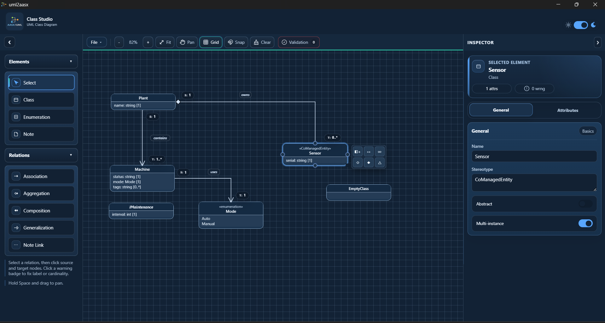
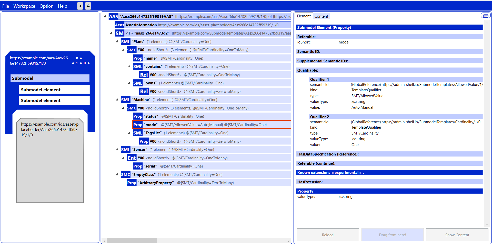

# UML AASX Studio - Public Distribution

This repository is the **public distribution channel** for UML AASX Studio.

## Application Screenshot

UML diagram edited in the desktop app:



AASX package opened after export from the same diagram:



## What is included

- Windows installer releases (`.exe`) in **GitHub Releases**.
- Third-party license and notice files required for distribution.
- Release checksum file for integrity verification.

## Download and install

1. Go to the **Releases** page.
2. Download the latest installer: `UML-AASX-Studio-Setup-<version>.exe`.
3. Run the installer and follow the setup steps.

## Windows security warning (SmartScreen)

If Windows shows a security warning, this usually means the app is not yet trusted by SmartScreen reputation.

- Click `More info` -> `Run anyway` (if you trust the source).
- Always verify the SHA256 checksum from `checksums.txt`.

## Verify file integrity (optional)

PowerShell example:

```powershell
Get-FileHash .\UML-AASX-Studio-Setup-0.1.7.exe -Algorithm SHA256
```

Compare the output with `release-assets/checksums.txt`.

## Third-party licenses

This distribution includes third-party software under their respective licenses.

- `THIRD_PARTY_LICENSES.md`
- `third_party/THIRD_PARTY_NOTICES.md`
- `third_party/license_texts/`

## Source code

The source repository is private.
This public repository is intended only for binary distribution and legal notices.

## Support

If you find an issue, open a GitHub Issue in this repository and include:

- App version
- Windows version
- Steps to reproduce
- Screenshot/logs if possible
